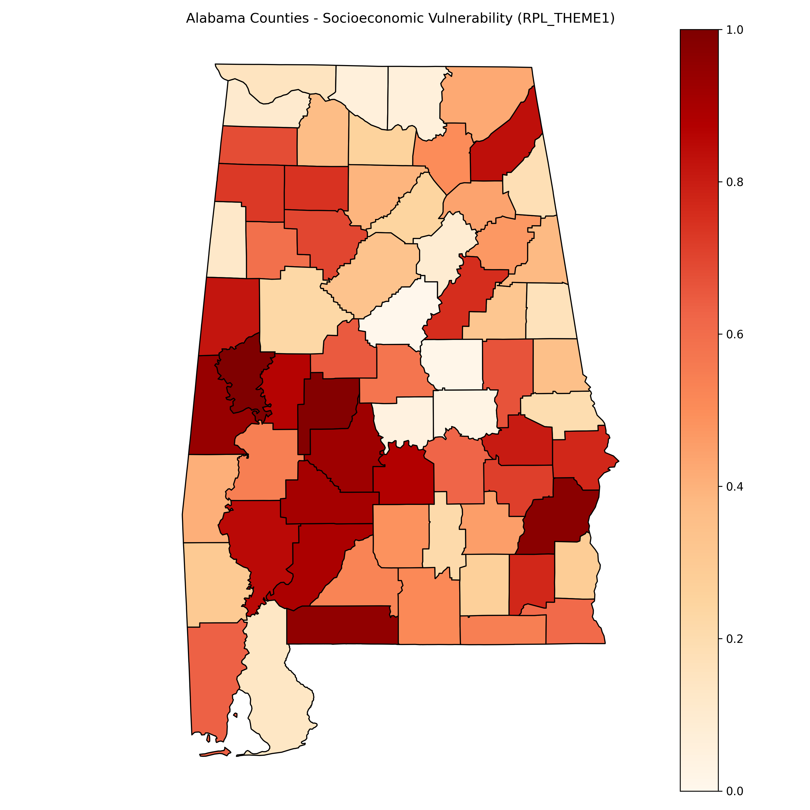
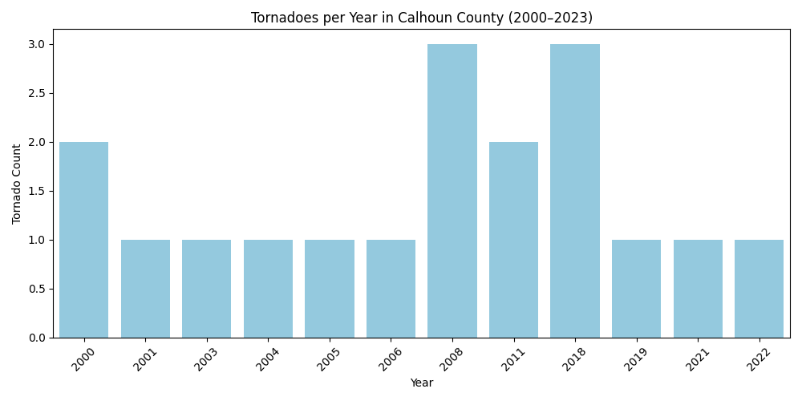
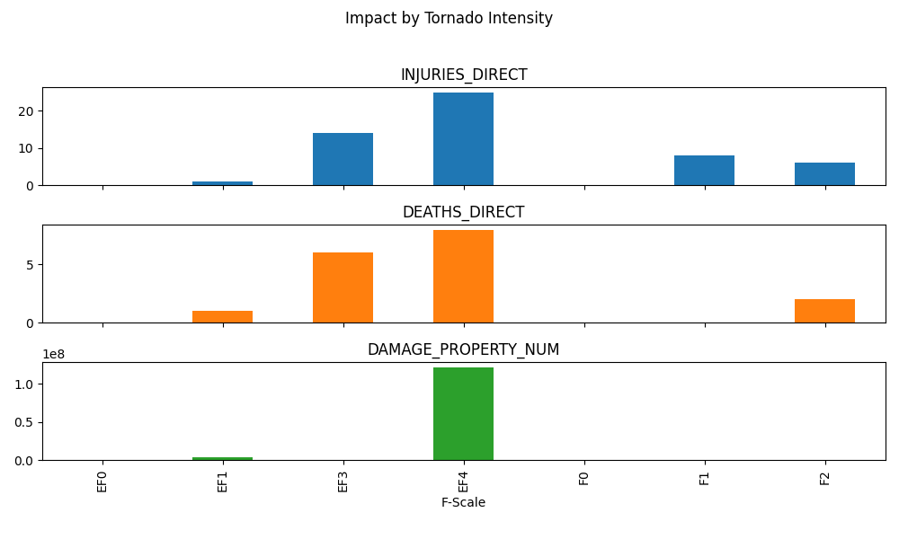

# Community Weather Risk Profiles – Calhoun County, Alabama

This project identifies and visualizes risk communication gaps for severe weather in Calhoun County, Alabama. It combines behavioral science, data science, and communication to highlight vulnerabilities in the ways in which weather warnings are received and acted upon, particularly in socially vulnerable or under-connected communities. 
---

## Focus Area

**Calhoun County, Alabama**, a region with a history of tornadoes (some strong to violent), varying broadband access, and social vulnerability factors. This project seeks to answer:

- Who may be missing warnings?
- What barriers exist (language, internet, trust)?
- How can we visualize and communicate those gaps?

---

## Core Data Sources

- **CDC Social Vulnerability Index (SVI)**  
- **U.S. Census ACS** (language, internet access)  
- **NOAA/NWS API** (historical warnings & alerts)  
- **SPC/NCEI** (tornado paths, hazard events)

---

## Tornado Frequency Over Time

The chart below shows the number of tornadoes per year in Calhoun County from 2000 to 2023. This time series highlights trends and peaks in tornado activity.

---

## Tornado Intensity & Damage

This bar chart displays tornado intensities (EF scale) alongside related injuries and damages. It reveals the correlation between tornado strength and impact on the community.

---

## Social Vulnerability Profiles

Using CDC’s Social Vulnerability Index data, this project overlays demographic and vulnerability factors on the county’s map, identifying populations more at risk during severe weather events. 
** This data is still being worked on** 
---

## Author

**Carly Anna**  
Weather communicator | Data-driven storyteller | Creator of CarlyAnnaWX
---
