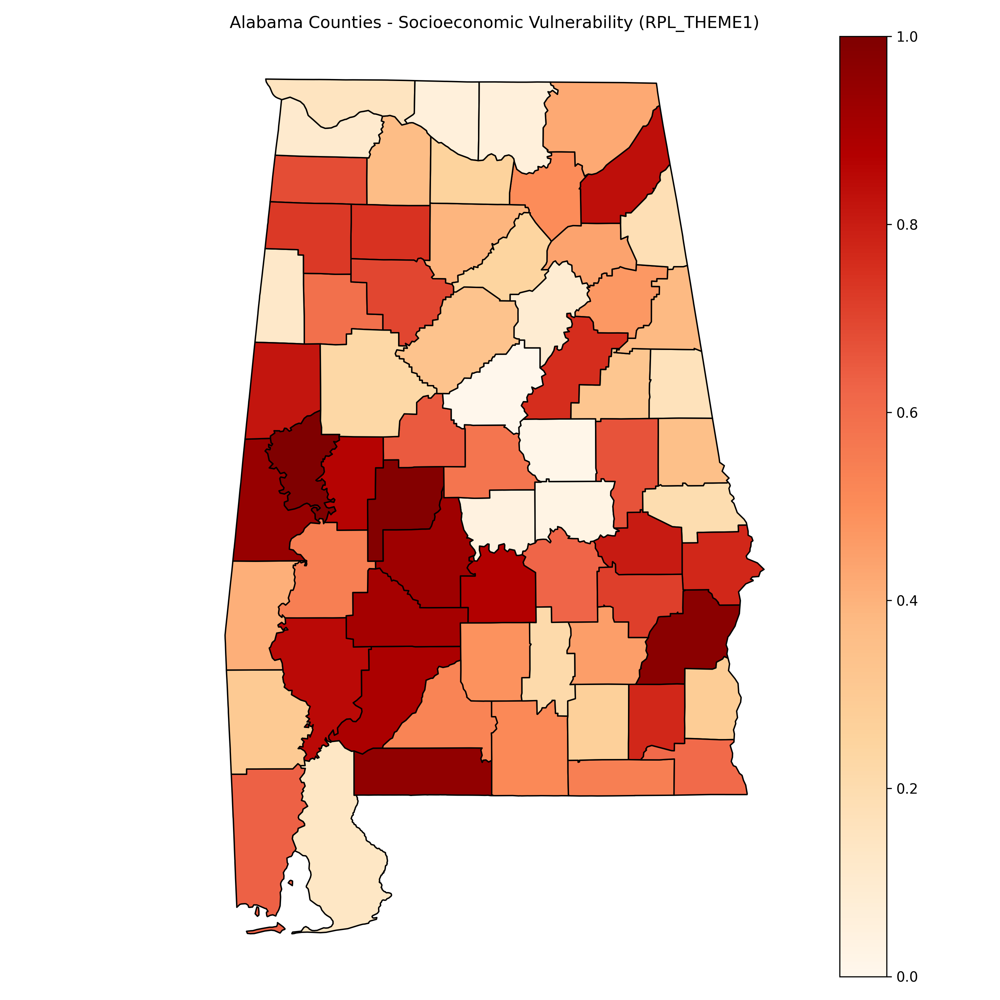
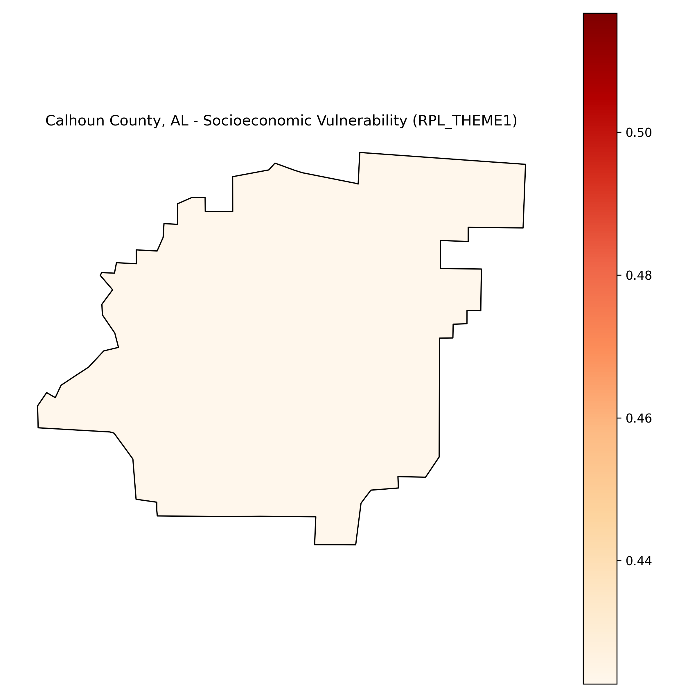

# Social Vulnerability Analysis for Calhoun County, Alabama

## Overview

This report presents an analysis of social vulnerability in Calhoun County, Alabama, using data from the CDC’s Social Vulnerability Index (SVI). The SVI measures socioeconomic and demographic factors that affect a community’s ability to prepare for, respond to, and recover from hazardous events.

## Statewide Context

The map below shows the socioeconomic vulnerability (RPL_THEME1) across all counties in Alabama. Higher values indicate higher vulnerability.

## Calhoun County Detail

The map below zooms into Calhoun County, highlighting its specific vulnerability score.

### Key Metrics for Calhoun County

- **Socioeconomic Vulnerability (RPL_THEME1):** 0.4697 (Moderate vulnerability)
- Other demographic factors include income levels, employment status, education, and household composition.

## Interpretation & Implications

Calhoun County shows a moderate level of socioeconomic vulnerability. It suggests that a significant portion of the population may face certain challenges during emergencies, like limited access to resources or difficulty evacuating.

These insights can guide local emergency managers and policymakers to focus risk communication and resource distribution efforts effectively.

---

